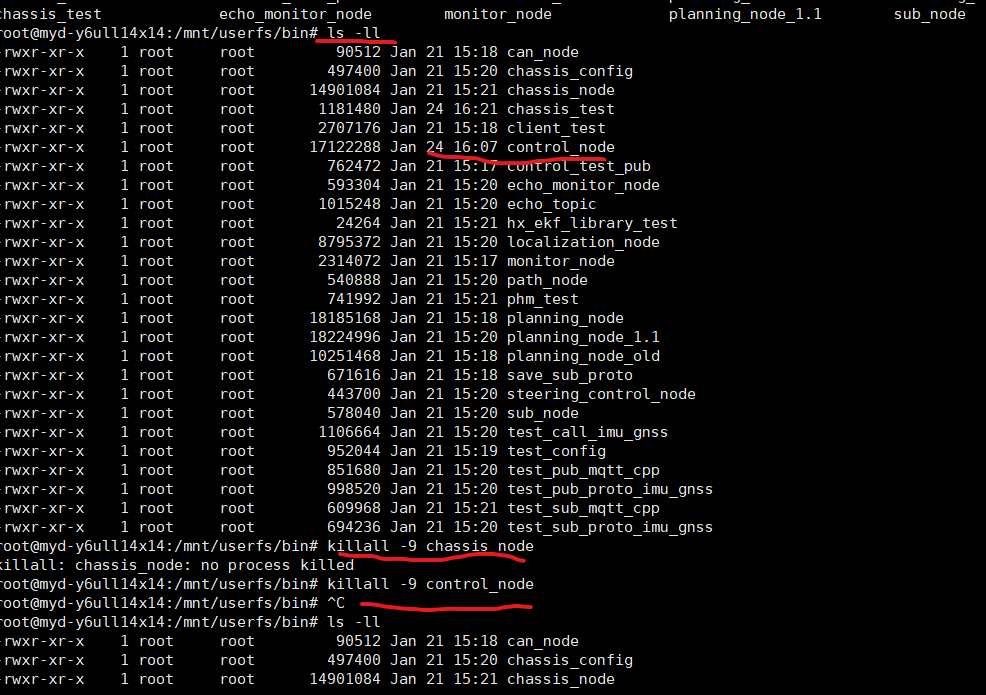
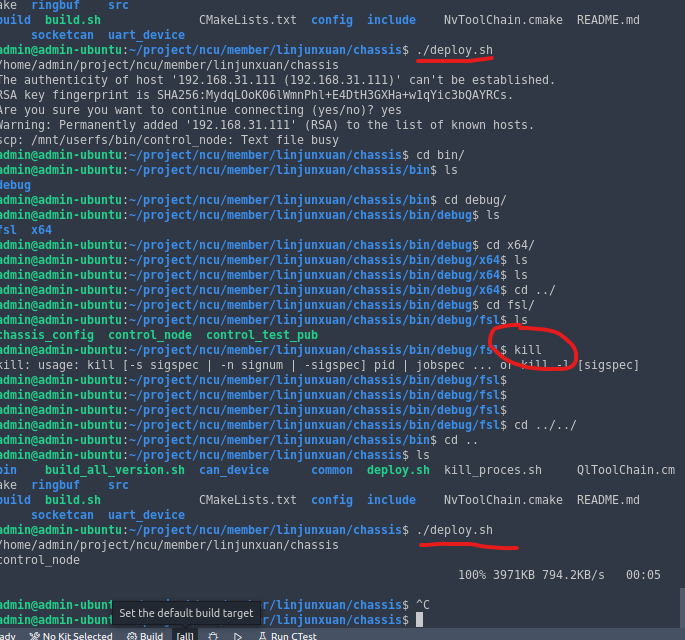
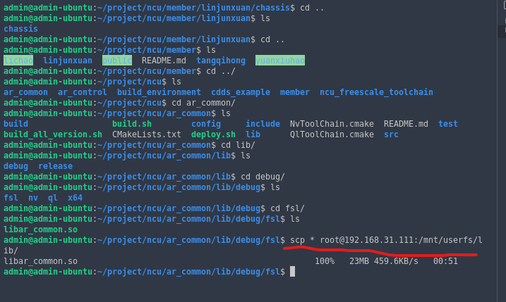

# ncu编译

### 1.进入/mnt/userfs/bin# ls ll

查看control_node文件

### 2.上传编译文件

修改deploy.sh属性 `chmod +x deploy.sh`

`./deploy.sh`

a.编译

### 3.更新文件脚本

更新匹配ar_common文件

# 1.进程线程

* pthread_create()：创建一个线程
* pthread_exit()：终止当前线程

* pthread_cancel()：中断另外一个线程的运行
* pthread_join()：阻塞当前的线程，直到另外一个线程运行结束

* pthread_attr_init()：初始化线程的属性
* pthread_attr_setdetachstate()：设置脱离状态的属性（决定这个线程在终止时是否可以被结合）

* pthread_attr_getdetachstate()：获取脱离状态的属性
* pthread_attr_destroy()：删除线程的属性

* pthread_kill()：向线程发送一个信号

# 2.内存分配

# 3.文件处理
